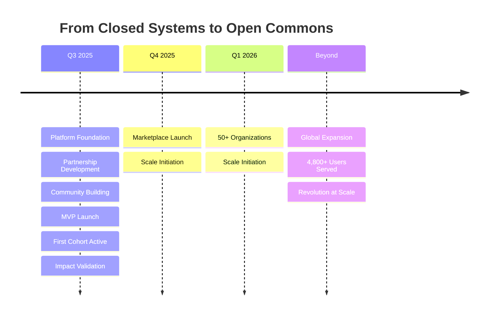

<div align="center">
  
# 🚀 **Briefcase AI**
### *Intelligence, Unchained*

**Breaking down the walls between knowledge and those who need it.**

[](https://briefcasebrain.io)
[](https://briefcasebrain.io)
[](https://briefcasebrain.io)

</div>

---

## 🌟 **We're Not Building Software. We're Architecting Revolution.**

Briefcase AI transforms complex knowledge from a guarded fortress into an open commons—where students stand on equal ground with seasoned professionals, where overwhelmed organizations multiply their impact exponentially, and where every important story finds the support it deserves.

## 💚 **What We Build**

### **AI for Impact, Not Metrics**
- **AIAFS Technology**: Forensic-level content verification ensuring truth in documents
- **Liberation Search**: Information retrieval that speaks human, not Boolean
- **Smart Routing**: Connecting overwhelming need with untapped capacity
- **Privacy First**: Differential privacy protecting the sensitive stories entrusted to us

### **The Knowledge Marketplace** *(Launching Q4 2025)*
Building an ecosystem where expertise flows like water—organizations fund impact, communities scale solutions, and contributors earn while they learn.

## 🛠️ **Quick Start**

```python
# Not just an API call. An act of transformation.
from briefcasebrain import IntelligenceEngine

engine = IntelligenceEngine(mission="democratize")
insight = engine.transform(challenge="complex_problem")
```

### **SDKs Available**
- 📦 [Python SDK](https://pypi.org/project/briefcasebrain-sdk/) - `pip install briefcasebrain-sdk`
- 📦 [JavaScript SDK](https://www.npmjs.com/package/briefcasebrain-sdk) - `npm install briefcasebrain-sdk`
- 📚 [Full API Documentation](https://github.com/briefcasebrain/.github/blob/main/README.md)

## 📊 **Impact Metrics**

| What We Measure | Current Impact | 2026 Goal |
|-----------------|---------------|-----------|
| **Unserved Needs Addressed** | 438/week identified | 1,200/month served |
| **Contributors Mobilized** | 2 institutions engaged | 500+ active participants |
| **Capacity Multiplied** | 3x efficiency proven | 10x scale achieved |
| **Access Barriers Removed** | ∞ | 0 |

## 🎨 **Our Design Philosophy**

Every pixel has purpose. Every interaction enables action. Every animation inspires change.

- **Liberation Green**: Progress visualized
- **Trust Black**: Depth and reliability  
- **Guardian Blue**: Protection as promise

## 🏗️ **Core Services**

### **Intelligence Processing**
Advanced AI extraction and analysis with comprehensive processing capabilities. Transform unstructured data into actionable insights.

### **Document Verification** 
Forensic-level content authentication using our AIAFS technology. Know what's real, what's generated, and what matters.

### **Unified Retrieval**
Multi-source search across all your data with hybrid strategies. Find exactly what you need, when you need it.

### **Analytics & Insights**
Comprehensive usage tracking and business intelligence. Understand patterns, predict needs, scale impact.

## 🤝 **Get Involved**

### **For Organizations**
Turn information overload into actionable intelligence  
→ [Start Your Transformation](https://briefcasebrain.io)

### **For Educational Institutions** 
Where learning means real-world impact  
→ [Become a Partner](https://briefcasebrain.io)

### **For Developers**
Code with purpose. Ship transformation  
→ [View Documentation](https://github.com/briefcasebrain/.github/blob/main/README.md)

### **For Contributors**
Join the revolution. Change the equation  
→ [Get Started](https://briefcasebrain.io)

## 🛠️ **Technology Stack**


## 📚 **Resources**

- 🌐 **Website**: [briefcasebrain.io](https://briefcasebrain.io)
- 📖 **Documentation**: [APIs & SDKs](https://github.com/briefcasebrain/.github/blob/main/README.md)
- 📦 **Python Package**: [pypi.org/project/briefcasebrain-sdk](https://pypi.org/project/briefcasebrain-sdk/)
- 📦 **NPM Package**: [npmjs.com/package/briefcasebrain-sdk](https://www.npmjs.com/package/briefcasebrain-sdk)
- 📧 **Questions & Support**: [aansh@briefcasebrain.com](mailto:aansh@briefcasebrain.com)

## 🔒 **Security & Compliance**

- **SOC 2 Type II** *(In Progress)*
- **GDPR Compliant**
- **End-to-End Encryption**
- **Differential Privacy**
- **Zero-Knowledge Architecture**

## 📈 **Roadmap**



## 🌍 **Our Manifesto**

> *We believe that somewhere between the student pulling an all-nighter and the professional drowning in complexity, between the researcher's curiosity and the organization's 100th crisis this week, lies an opportunity to rewrite how knowledge flows through society.*
>
> *Traditional systems weren't built for everyone. **We are.***

---

<div align="center">

**This is what democracy looks like at 60fps.**  
**This is what accessibility sounds like in screen readers.**  
**This is what transformation feels like under your fingertips.**

*Building the bridge between knowledge and those who seek it.*

[](https://briefcasebrain.io)
[](https://github.com/briefcasebrain/.github/blob/main/README.md)
[](https://pypi.org/project/briefcasebrain-sdk/)
[](https://www.npmjs.com/package/briefcasebrain-sdk)

© 2025 Briefcase AI. **Intelligence, Unchained.**

</div>
